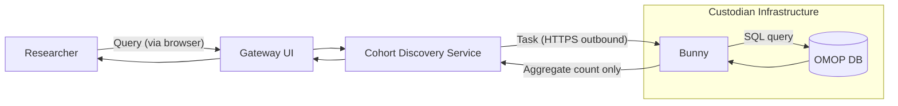

# Architecture

The Cohort Discovery Service is built on a federated architecture that allows researchers to query pseudonymised health data held by Data Custodians — without that data ever leaving the Custodian's environment.

- :material-lan: **Platform Architecture**

    ---
    High-level view of how the components fit together.

    [:octicons-arrow-right-24: Platform Architecture](platform.md)

- :material-database-sync: **Mapping to OMOP**

    ---
    How source data is transformed to the OMOP Common Data Model.

    [:octicons-arrow-right-24: Mapping to OMOP](omop-mapping.md)

- :material-shield-lock: **Data Governance & Security**

    ---
    The controls in place to protect patient data.

    [:octicons-arrow-right-24: Governance & Security](governance.md)

---

## Core principle: data never moves

The query tool (e.g. Bunny) **makes only outbound requests** — no inbound connections are required through the Custodian's firewall. Only aggregate, disclosure-controlled counts are returned.
