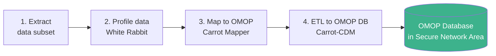
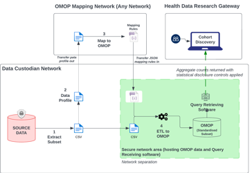

# Mapping to OMOP

The Cohort Discovery Service requires data to be formatted using the **OMOP Common Data Model (CDM)**. This page explains the recommended approach for mapping source data to OMOP.

!!! info "OMOP CDM"
    OMOP is used globally by academic and healthcare organisations to support observational health research. It is patient-centric, tabular, extendable, built for analytics, and has a relational design. For background, see the [OHDSI OMOP CDM documentation](https://ohdsi.github.io/CommonDataModel/).

---

## Recommended architecture: separate mapping from ETL

Mapping source data to OMOP can be challenging. Separating the **mapping logic** from the **ETL process** allows non-technical subject matter experts to create mapping rules that are then applied by automated ETL tools.

*Figure 2 — Example architecture separating OMOP mapping from ETL*

### Step-by-step

1. **Extract** a subset of your raw identifiable data for OMOP mapping
2. **Profile** the extracted data using White Rabbit to understand its structure
3. **Map** the profiled data to OMOP using Carrot Mapper, generating a JSON mapping file
4. **Transform and load** the extracted data using the mapping file via Carrot-CDM

---

## Supported tools

| Process | Tool | Description |
|---------|------|-------------|
| **Data Profiling** | [White Rabbit](https://www.ohdsi.org/software-tools/) | OHDSI tool that scans source data and produces detailed information on tables, fields, and values. First step in the ETL process. Used for structural mapping. |
| **Map to OMOP** | [Carrot Mapper](https://carrot4omop.ac.uk/Carrot-Mapper/) | Web-tool that maps the White Rabbit scan output to generate a JSON mapping file defining the ETL guidelines for the dataset. |
| **ETL to OMOP** | [Carrot-CDM](https://carrot4omop.ac.uk/CaRROT-CDM/) | ETL tool that automates extraction of pseudonymised data, transformation to OMOP CDM, and loading to the query tool database. |

!!! note "Tools are not mandatory"
    These tools are not required. Other tools are also available, for example [Usagi](https://www.ohdsi.org/analytic-tools/usagi/) (OHDSI) for manual OMOP code mappings. HDR UK has worked with the CaRROT tools and can provide support for them specifically.

---

## OMOP mapping support

HDR UK and partners at the **Health Informatics Centre (HIC)** at the University of Dundee offer OMOP mapping services using CaRROT tools. Commercial vendors also provide this service.

!!! tip "Get mapping support"
    Contact your HDR UK contact to discuss OMOP mapping support options.

---

## OMOP CDM version support

| Version | Support status |
|---------|---------------|
| OMOP CDM 5.4 | **Recommended** for new mappings |
| OMOP CDM 5.3 | Fully supported — no migration required |
| Other versions | Contact HDR UK before proceeding |

See the [Bunny deployment requirements](https://hutch.health/bunny/deployment/requirements) for the latest supported versions.

---

## What fields are required?

The minimum OMOP fields required for Cohort Discovery are defined in the [OMOP Requirements](../omop/index.md) section.
