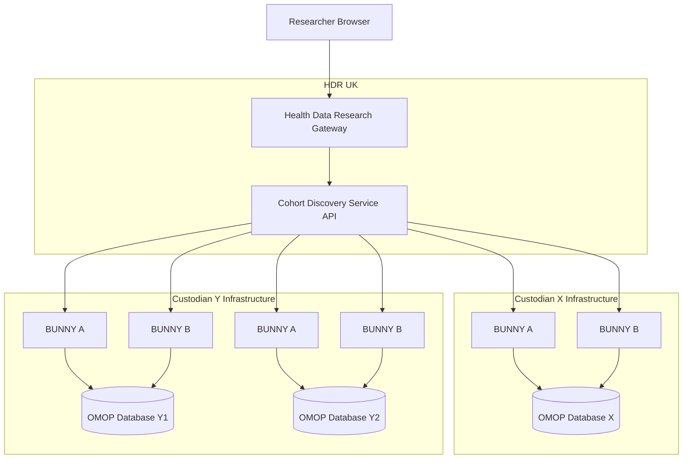
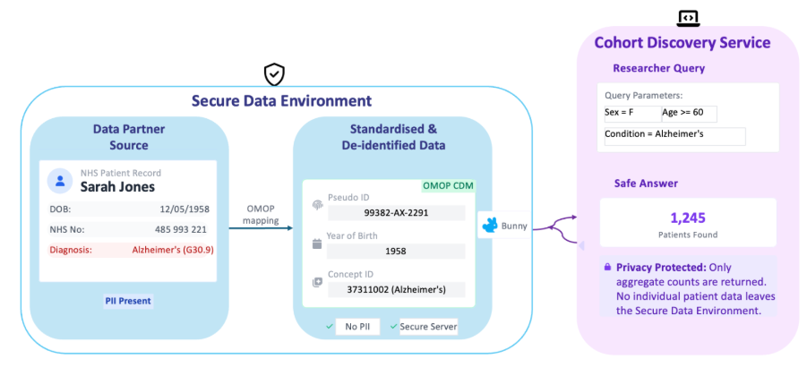

# Platform Architecture

The Cohort Discovery Service operates across multiple organisational boundaries using a federated model. Each Data Custodian maintains full control of their data within their own infrastructure.

---

## High-level architecture

*Figure 1 — Cohort Discovery Federated Platform Architecture*

---

## Secure Network Area

Each Data Custodian must provision a **Secure Network Area** — a network zone that:

- Is **isolated** from environments containing identifiable data
- Contains **only** the pseudonymised OMOP dataset and the query retrieval software
- Requires **outbound HTTPS only** (port 443) — no inbound firewall rules needed
- Supports OCI-compliant container runtimes (Docker, Podman, or Kubernetes)

!!! note "Flexible deployment"
    The system can technically be configured so the query retrieval software does not sit in a separate VM, and the OMOP data can be a view on a larger datastore. However, **clear separation** between data zones is strongly recommended to simplify information governance reviews.

### Infrastructure specification (Bunny)

| Requirement | Minimum Specification |
|-------------|----------------------|
| CPU | 2 vCPUs |
| Memory (RAM) | 4 GB |
| Container Runtime | OCI-compliant (Docker, Podman, or Kubernetes) |
| Network | Outbound HTTPS (port 443) only |
| Database | PostgreSQL 14–18 · SQL Server 2019 or 2022 · DuckDB 1.x · Snowflake |

!!! info "Requirements may vary"
    Requirements may vary depending on workload and deployment environment. See the [Bunny user guide](https://health-informatics-uon.github.io/hutch/bunny) and [deployment requirements](https://hutch.health/bunny/deployment/requirements) for the latest specification.

---

## What the Secure Network Area contains

The recommended minimal deployment contains exactly two components:

1. **The pseudonymised OMOP dataset** — the minimum fields required for Cohort Discovery (see [OMOP Requirements](../omop/index.md))
2. **The query retrieving software** — e.g. Bunny, BC|INSIGHT, or a custom implementation

---

## Query retrieval software options

=== "Bunny (Open Source)"

    Developed by the University of Nottingham. Bunny is the recommended open-source option.

    - Fetches tasks from the Cohort Discovery API
    - Makes **only outgoing requests** (outbound HTTPS)
    - Supports obfuscation (low-count suppression and rounding)
    - Can participate in federated networks via Hutch Relay
    - Container images available for easy deployment

    [:octicons-arrow-right-24: Connecting Bunny](../bunny/index.md)

=== "BC|INSIGHT (Commercial)"

    Developed by BC Platforms. A proprietary query retrieval tool.

    Contact BC Platforms directly for installation instructions, contract options, and support.

=== "Build Your Own"

    Data Custodians are welcome to build their own query retrieval tool. It must meet the API standards documented in the [Swagger documentation](https://api.cohort-discovery.dev.hdruk.cloud/api/documentation).

    Contact the HDR UK Technology Team to discuss this option.
