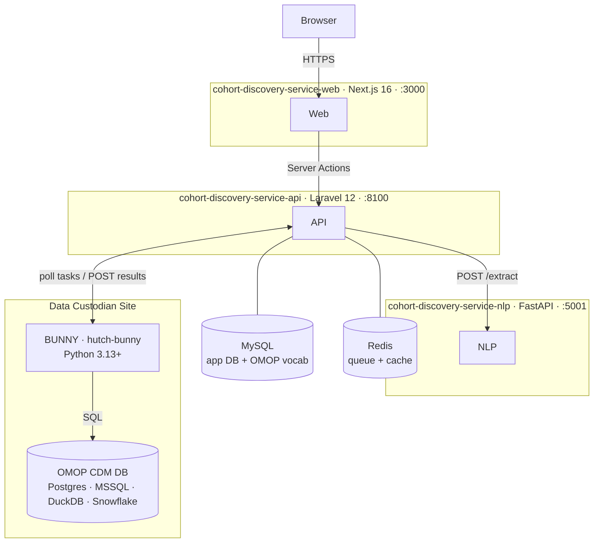

# Developer Guide

The Cohort Discovery Service is a federated platform that lets researchers run cohort queries against pseudonymised health data held by Data Custodians — without the underlying data ever leaving a custodian's infrastructure. This guide covers everything you need to develop, run, and contribute to the three services that make it up.

---

## Services

Three services are actively developed in this codebase. A fourth — **BUNNY** — is an external dependency deployed at each custodian site.

| Service | Repo | Stack | Dev Port | Role |
|---------|------|-------|----------|------|
| **Web** | `cohort-discovery-service-web` | Next.js 16, React 18, TypeScript | 3000 | Frontend UI — App Router, Server Actions, role-based views |
| **API** | `cohort-discovery-service-api` | Laravel 12, PHP 8.2+, MySQL, Redis | 8100 | Core backend — queries, tasks, OMOP concepts, async jobs |
| **NLP** | `cohort-discovery-service-nlp` | FastAPI, Python 3.11, RapidFuzz | 5001 | Free-text → OMOP concept extraction via fuzzy matching |
| BUNNY | `hutch-bunny` (external — Univ. Nottingham) | Python 3.13+, SQLAlchemy | — | Custodian-side task resolver |

The **Web** layer calls the **API** only — it never contacts the NLP service or custodian databases directly. The **API** and **NLP** service both share access to the OMOP vocabulary database.

---

## Deployment modes

The platform runs in two modes, set via an environment variable in each service. Choose the right mode before you start.

| Mode | API (`APP_OPERATION_MODE`) | Web (`APPLICATION_MODE`) | Auth |
|------|---------------------------|--------------------------|------|
| **Standalone** | `standalone` | `standalone` | Laravel Passport + local JWT — self-contained, no external dependencies |
| **Integrated** | `integrated` | `integrated` | HDR UK Gateway OAuth2 SSO — users authenticate via the Gateway |

Use **standalone** for local development. Use **integrated** for production deployments within the HDR UK Gateway.

[:octicons-arrow-right-24: Deployment Modes — full configuration walkthrough](modes.md)

---

## In this guide

- :material-rocket-launch: **Quick Start**

    ---
    Get all three services running locally in one go.

    [:octicons-arrow-right-24: Quick Start](quick-start.md)

- :material-server: **API Service**

    ---
    Laravel API: env config, OMOP setup, artisan commands, testing.

    [:octicons-arrow-right-24: API Service](api.md)

- :material-monitor: **Web Service**

    ---
    Next.js frontend: env config, dev server, testing, patterns.

    [:octicons-arrow-right-24: Web Service](web.md)

- :material-brain: **NLP Service**

    ---
    FastAPI NLP: env config, endpoints, fuzzy matching tuning.

    [:octicons-arrow-right-24: NLP Service](nlp.md)

- :material-swap-horizontal: **Deployment Modes**

    ---
    Standalone vs Integrated — what changes and how to configure each.

    [:octicons-arrow-right-24: Deployment Modes](modes.md)

- :material-flask: **Synthetic Data (somop)**

    ---
    Generate synthetic OMOP data for local BUNNY testing without real patient records.

    [:octicons-arrow-right-24: somop](somop/index.md)

- :material-source-pull: **Contributing**

    ---
    Branch workflow, pre-PR checks, PR title conventions, coding standards.

    [:octicons-arrow-right-24: Contributing](contributing.md)

