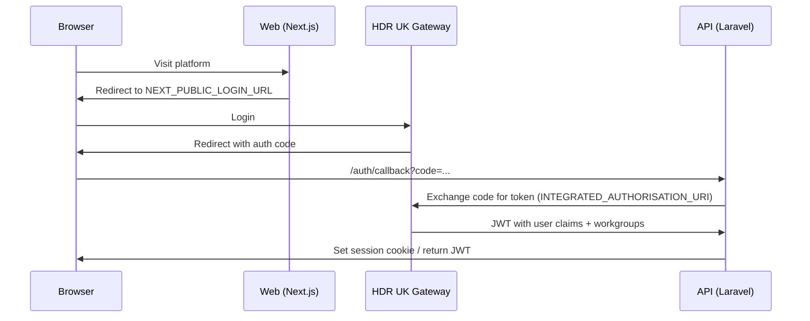

# Deployment Modes

The platform supports two authentication modes. The mode is set per-service via an environment variable and affects how users authenticate, how tokens are validated, and whether the platform operates independently or as part of the HDR UK Gateway.

---

## At a glance

| | Standalone | Integrated |
|---|---|---|
| **When to use** | Local development, standalone deployments | Production with HDR UK Gateway |
| **API env var** | `APP_OPERATION_MODE=standalone` | `APP_OPERATION_MODE=integrated` |
| **Web env var** | `APPLICATION_MODE=standalone` | `APPLICATION_MODE=integrated` |
| **Auth mechanism** | Laravel Passport OAuth2 + local JWT | HDR UK Gateway OAuth2 SSO |
| **User management** | Users stored locally in the platform DB | Users synced from Gateway JWT claims |
| **Login flow** | Local login page | Redirect to Gateway login |
| **Token signing** | `JWT_SECRET` | `INTEGRATED_JWT_SECRET` (must match Gateway's `JWT_SECRET`) |

---

## Standalone mode

Standalone mode runs the Cohort Discovery Service as a fully self-contained platform with its own user database and authentication.

### API configuration

```dotenv
APP_OPERATION_MODE=standalone

# JWT signing
JWT_SECRET=a-long-random-secret-for-local-dev
STANDALONE_JWT_TTL_MINUTES=120

# Passport OAuth token TTLs
PASSPORT_TOKEN_EXPIRES_IN_DAYS=30
PASSPORT_REFRESH_TOKEN_EXPIRES_IN_DAYS=60
```

### Web configuration

```dotenv
APPLICATION_MODE=standalone
NEXT_PUBLIC_LOGIN_URL=http://localhost:3000/auth/login
```

### Seeding demo users

```bash
php artisan db:seed --class=StandaloneDemoSeeder
```

Set credentials before seeding:
```dotenv
DEMO_USER_EMAIL=admin@example.com
DEMO_USER_PASSWORD=YourPassword1!
DEMO_RESEARCHER_EMAIL=researcher@example.com
DEMO_RESEARCHER_PASSWORD=YourPassword1!
```

---

## Integrated mode

Integrated mode delegates authentication to the HDR UK Gateway via OAuth2. Users authenticate against the Gateway; their roles and workgroup memberships are embedded in the JWT claims the API receives.

### How it works



### Step 1: Create the OAuth client in the Gateway

In the Gateway API repo, run the Cohort Discovery seeder:

```bash
php artisan db:seed --class=CohortServiceUserSeeder
```

This outputs an OAuth `client_id` and `client_secret`. Note these — you need them for the API.

Also configure the Gateway's `.env` to point at the API service:

```dotenv
COHORT_DISCOVERY_URL=http://localhost:3000
COHORT_DISCOVERY_AUTH_URL=http://localhost:8100/auth/callback
COHORT_DISCOVERY_SERVICE_ACCOUNT=cohort-service@hdruk.ac.uk
COHORT_DISCOVERY_USE_OAUTH2=true
COHORT_DISCOVERY_ADD_TEAMS_TO_JWT=true
```

### Step 2: Configure the API service

```dotenv
APP_OPERATION_MODE=integrated

# Must match the Gateway's JWT_SECRET exactly
INTEGRATED_JWT_SECRET=the-gateway-jwt-secret

# Gateway URLs
INTEGRATED_API_URI=http://localhost:8000/api/v1/
INTEGRATED_AUTHORISATION_URI=http://localhost:8000/oauth2/token

# OAuth client from Gateway seeder (Step 1)
INTEGRATED_CLIENT_ID=<client_id>
INTEGRATED_CLIENT_SECRET=<client_secret>

# API callback URL
OAUTH_INTERNAL_REDIRECT=http://localhost:8100/auth/callback
OAUTH_PLACEHOLDER_PASSWORD=a-long-random-placeholder

# Basic auth for collection hosts
CLIENT_BASIC_AUTH_ENABLED=true
```

### Step 3: Configure the Web service

```dotenv
APPLICATION_MODE=integrated
NEXT_PUBLIC_LOGIN_URL=http://localhost:8000/login?redirect_cohort_discovery_upon_signin=http://localhost:3000
API_BASE_URL=http://localhost:8100
```

### Verifying integrated auth

```bash
# Obtain a Gateway JWT, then test the API:
curl -H "Authorization: Bearer <gateway-jwt>" \
     http://localhost:8100/api/v1/user
```

A 200 response with the user object confirms integrated auth is working.

---

## Switching modes

You can switch modes without re-seeding the database. Only the environment variables need to change. The `ApplicationModeServiceProvider` reads `APP_OPERATION_MODE` at boot and binds the appropriate `AuthenticationServiceInterface` implementation:

- `standalone` → `StandaloneAuthenticationService`
- `integrated` → `IntegratedAuthenticationService`

The Web service reads `APPLICATION_MODE` to determine login redirect behaviour and which auth endpoints to call.

!!! warning "Restart required"
    After changing `APP_OPERATION_MODE` or `APPLICATION_MODE`, restart the API (`composer run dev`) and Web (`npm run dev`) servers for the change to take effect.
