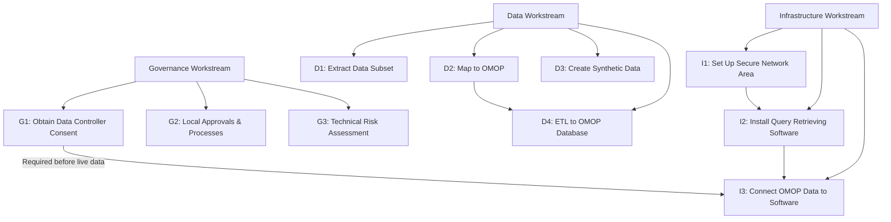
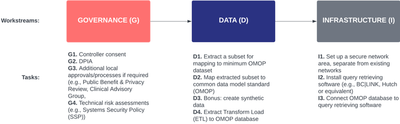
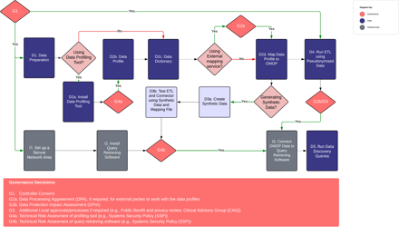

# Onboarding Overview

Onboarding to the Cohort Discovery Service requires completing three parallel workstreams. An introductory meeting with the HDR UK Technology Team will be held at the start to define tasks, responsibilities, and timelines.

---

## The Three Workstreams

*Figure 3 — Cohort Discovery workstreams and tasks*

*Figure 4 — Interdependencies between tasks for onboarding to Cohort Discovery*

!!! warning "Key dependency"
    **G1 (Data Controller Consent)** must be completed before real (non-synthetic) data is connected to the Cohort Discovery Service. D1, D2, and D3 can proceed before G1 is complete.

---

## Workstream Summary

=== "Governance"

    | Step | Description | Responsible |
    |------|-------------|-------------|
    | **G1** | Obtain Data Controller consent | Data Custodian |
    | **G2** | Carry out local approvals and processes | Data Custodian |
    | **G3** | Technical risk assessment (e.g. SSP) | Data Custodian |

    Governance steps are not always linear and can occur in any order. Start as early as possible.

    [:octicons-arrow-right-24: Governance Workstream](../workstreams/governance.md)

=== "Data"

    | Step | Description | Responsible |
    |------|-------------|-------------|
    | **D1** | Extract a subset of raw identifiable data | Data Custodian |
    | **D2** | Map extracted subset to OMOP CDM | Data Custodian (HDR UK can assist) |
    | **D3** | Create synthetic data for testing | Data Custodian (optional but recommended) |
    | **D4** | ETL extracted data to create OMOP database | Data Custodian |

    [:octicons-arrow-right-24: Data Workstream](../workstreams/data.md)

=== "Infrastructure"

    | Step | Description | Responsible |
    |------|-------------|-------------|
    | **I1** | Set up secure network area | Data Custodian |
    | **I2** | Install query retrieving software | Data Custodian |
    | **I3** | Connect OMOP data to query retrieving software | Data Custodian |

    [:octicons-arrow-right-24: Infrastructure Workstream](../workstreams/infrastructure.md)

---

## Iterative approach

Cohort Discovery supports an iterative onboarding model. You do not need to onboard all your data at once.

- **Multiple datasets**: Bunny requires two instances per OMOP database. Multiple sets can run on the same server.
- **New fields**: Additional data fields can be added over time following the same governance process.

!!! tip
    Focus first on the key fields needed to answer pressing research questions. Additional fields can be added iteratively as community needs evolve.
