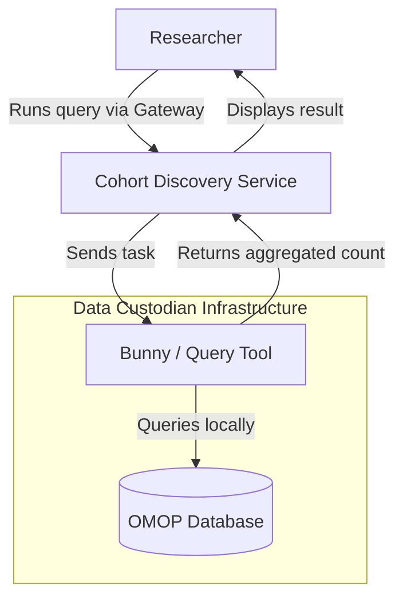

# Cohort Discovery Service

[:octicons-arrow-right-24: Get Started](getting-started/index.md){ .md-button .md-button--primary }

## Overview

> The Cohort Discovery Service enables researchers to query pseudonymised, OMOP-mapped health data held by Data Custodians across the UK — without the data ever leaving a Custodian's environment. It is integrated into the [Health Data Research Gateway](https://healthdatagateway.org/) and operates on a federated architecture designed to balance research access with strong data governance.

- :material-rocket-launch: **Getting Started**

    ---
    Understand the prerequisites and get an overview of the three onboarding workstreams.

    [:octicons-arrow-right-24: Getting Started](getting-started/index.md)

- :material-lan: **Architecture**

    ---
    Learn how the federated platform works, how data flows, and how security is enforced.

    [:octicons-arrow-right-24: Architecture](architecture/index.md)

- :material-database: **OMOP Requirements**

    ---
    Understand which OMOP CDM tables and fields must be populated for your data to be discoverable.

    [:octicons-arrow-right-24: OMOP Requirements](omop/index.md)

- :material-rabbit: **Connecting Bunny**

    ---
    Step-by-step guide to connecting the Bunny query tool to the Cohort Discovery Service.

    [:octicons-arrow-right-24: Bunny Setup](bunny/index.md)

- :material-clipboard-list: **Workstreams**

    ---
    Detailed guidance for the Governance, Data, and Infrastructure onboarding workstreams.

    [:octicons-arrow-right-24: Workstreams](workstreams/index.md)

- :material-help-circle: **Reference & Support**

    ---
    Glossary of terms, query tool comparison, and how to get support.

    [:octicons-arrow-right-24: Reference](reference/glossary.md)

---

## What is the Cohort Discovery Service?

The Cohort Discovery Service allows researchers to run feasibility queries against pseudonymised patient data held by Data Custodians — NHS Trusts, universities, and other healthcare organisations — without the underlying data leaving the Custodian's infrastructure. Only **aggregated, disclosure-controlled counts** are returned to the researcher.

The service was initially developed through the [CO-CONNECT project](https://www.hdruk.ac.uk/projects/co-connect/) and is now an integrated part of the Health Data Research Gateway.

!!! hdruk "HDR UK"
    This documentation is maintained by the [Health Data Research UK](https://www.hdruk.ac.uk) Technology Team. For general enquiries, email [gateway@hdruk.ac.uk](mailto:gateway@hdruk.ac.uk) or use the **Need Support?** button on any page of the Gateway.

---

## How it works

Data never leaves the Custodian. The query tool (e.g. Bunny) makes only **outbound** requests and returns only **aggregate counts** — no row-level data is ever transmitted.
