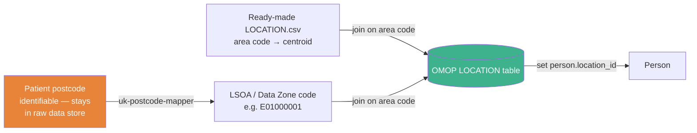
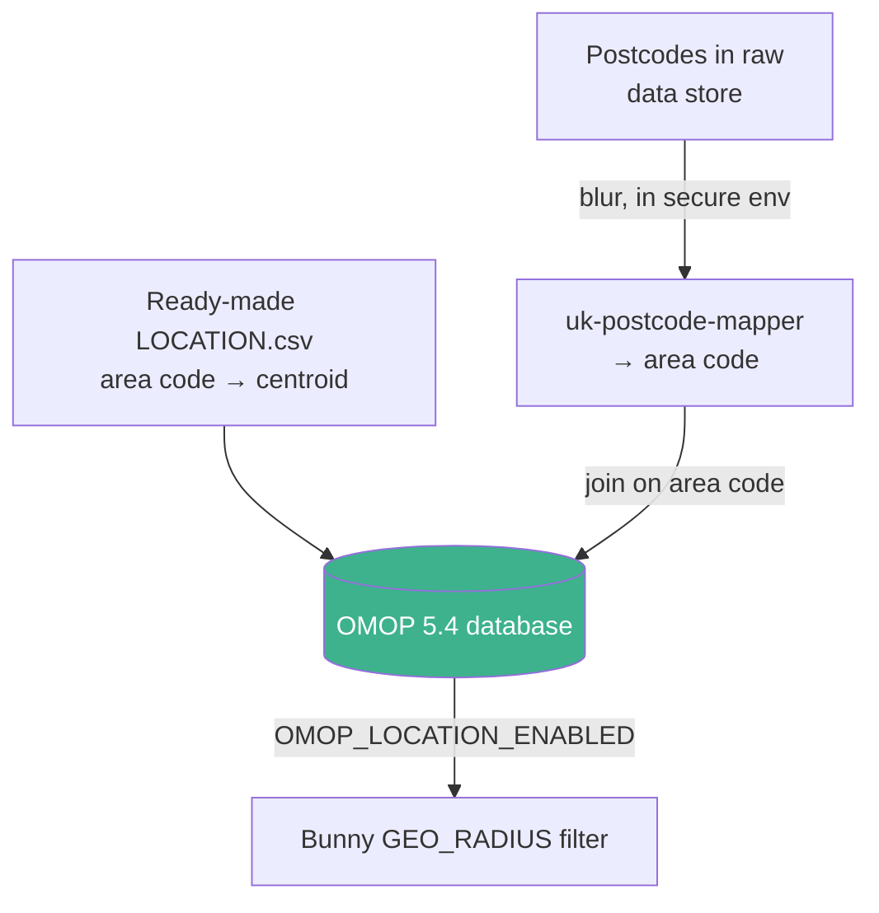

# Location & Geo-radius Filtering

Bunny can answer **geographic** cohort queries — "how many matching patients live
within *N* km of this point?" — using the OMOP `LOCATION` table. This page explains how
to populate that table in a way that is useful for discovery **without** holding any
patient location PII.

!!! info "Why not just store real coordinates?"
    [Governance](../architecture/governance.md) requires that **all patient location PII
    is withheld** before data enters the secure area — a postcode or exact coordinate is
    identifying. Yet location filtering needs coordinates. The resolution is to store the
    **centroid of a coarse statistical area** (LSOA / Data Zone) rather than a person's
    real location: many people share the same point, so no individual is locatable.

---

## How Bunny uses location

Bunny's optional geo-radius filter matches persons whose `location_id` joins to a
`LOCATION` row whose `latitude`/`longitude` fall within a given radius of a query point.

| Requirement | Detail |
|-------------|--------|
| OMOP CDM version | **5.4 only** — `latitude`/`longitude` were added to `LOCATION` in 5.4 |
| Bunny version | **v1.8+** |
| Enable flag | `OMOP_LOCATION_ENABLED` (see [Bunny configuration](../bunny/configuration.md)) |
| Query rule | `GEO_RADIUS` — see [Availability — Location filtering](https://hutch.health/concepts/availability#location-filtering) |
| Join | `person.location_id` → `location.location_id` → (`latitude`, `longitude`) |

!!! note "This is the one feature that requires CDM 5.4"
    Everything else works on 5.3. If location filtering is the *only* reason you would
    move to 5.4, see the [minimum dataset exception](minimum-dataset.md).

!!! info "Unresolved locations are excluded, not errored"
    A person with no `location_id` set, or whose `LOCATION` row has no `latitude`/`longitude`,
    is simply never matched by `GEO_RADIUS` — it doesn't fail the query. This is normal for
    postcodes that don't resolve to an area (PO boxes, Crown dependencies, brand-new addresses).

---

## The recommended approach: blur to an LSOA centroid

Do **not** map a person's real coordinates or store their postcode. Instead:

1. **Blur** the postcode to the coarse statistical area that contains it — an **LSOA**
   (England & Wales), **Data Zone** (Scotland) or **Super Data Zone** (Northern Ireland).
2. Map that area to its **population-weighted centroid** — a single (lat, lon) point
   representative of where people in the area live.
3. Store the centroid in the `LOCATION` table and link the person to it. Leave every other
   `LOCATION` field (`address_1`, `city`, `state`, `zip`, `county`, `country_concept_id`, …)
   `NULL` — none of them are needed for `GEO_RADIUS` and populating them from real addresses
   would reintroduce the PII this approach avoids.

Every person in the same area gets the **same** centroid, so the stored coordinate never
identifies an individual — but the anonymity set size varies by nation, so don't treat it as a
single number:

| Area type | Nation | Typical residents per area |
|-----------|--------|-----------------------------|
| LSOA | England & Wales | ~1,000–3,000 (design mean ~1,500) |
| Data Zone | Scotland | ~500–1,000 (design mean ~750) |
| Super Data Zone | Northern Ireland | ~2,000–2,500 (2021 census average ~2,240) |

Because the boundary-to-centroid mapping is deterministic and published by ONS/NRS/NISRA,
storing the area code (`location_source_value`) alongside the centroid adds no disclosure
risk beyond the centroid itself. The usual composition risk still applies, though: combining
`GEO_RADIUS` with other rare quasi-identifiers (age, sex, a rare condition) in a small or
homogeneous area can shrink a matching cohort to a handful of people. Resulting counts remain
subject to Bunny's normal low-number suppression and rounding — see
[Obfuscation settings](../bunny/configuration.md#obfuscation-settings) — but if you're
running `GEO_RADIUS` combined with narrow clinical filters, treat the area size as a floor on
how small a "safe" query can get, not a guarantee.



*The postcode never leaves the raw data store; only the area code and centroid reach OMOP —
and the centroid itself comes from the ready-made table, not from re-deriving it per patient.*

!!! tip "Why the centroid and not the area polygon?"
    Bunny's `GEO_RADIUS` rule works on a single point per location. A population-weighted
    centroid (the point representative of where residents actually live, not the geometric
    middle) is the natural single-point summary of an LSOA.

---

## Tooling

### 1. Ready-made `LOCATION` tables — [recommended approach]

You usually don't need to compute or maintain centroids yourself. This repo ships pre-built
OMOP `LOCATION` tables for the whole UK (and per nation) under
[`locations/`](https://github.com/HDRUK/cohort-discovery-service-docs/tree/main/locations),
using the same centroids `uk-postcode-mapper` emits. You'll still need `uk-postcode-mapper`
(or equivalent) to turn each of *your* patients' postcodes into an area code — see
[§2](#2-postcode-area-centroid-uk-postcode-mapper) — but you won't need it to build the
centroid side of the table. Download the CSV for the coverage you need directly from the
links below:

| Table | Coverage | Rows |
|-------|----------|-----:|
| [`locations/uk/LOCATION.csv`](https://github.com/HDRUK/cohort-discovery-service-docs/blob/main/locations/uk/LOCATION.csv) | Whole UK | 43,914 |
| [`locations/england/LOCATION.csv`](https://github.com/HDRUK/cohort-discovery-service-docs/blob/main/locations/england/LOCATION.csv) | England (LSOA 2021) | 33,755 |
| [`locations/wales/LOCATION.csv`](https://github.com/HDRUK/cohort-discovery-service-docs/blob/main/locations/wales/LOCATION.csv) | Wales (LSOA 2021) | 1,917 |
| [`locations/scotland/LOCATION.csv`](https://github.com/HDRUK/cohort-discovery-service-docs/blob/main/locations/scotland/LOCATION.csv) | Scotland (Data Zone 2022) | 7,392 |
| [`locations/northern-ireland/LOCATION.csv`](https://github.com/HDRUK/cohort-discovery-service-docs/blob/main/locations/northern-ireland/LOCATION.csv) | Northern Ireland (Super Data Zone 2021) | 850 |

See [`locations/README.md`](https://github.com/HDRUK/cohort-discovery-service-docs/blob/main/locations/README.md)
for provenance and how to regenerate. The area code is stored in `location_source_value`.
Because those codes are exactly what `uk-postcode-mapper` returns, attaching location to
real data is a **code join** — no coordinate maths required:

1. Download the relevant `LOCATION.csv` above and load it into your OMOP database as-is.
2. For each person, blur their postcode to an area code using `uk-postcode-mapper` (see below).
3. Set `person.location_id` to the `location_id` of the matching `location_source_value`.

!!! warning "Keep the CSV and the mapper on the same boundary vintage"
    The join only works if `uk-postcode-mapper`'s area codes and the ready-made CSV's
    `location_source_value` codes come from the **same** boundary release (the tables above
    are pinned to LSOA 2021 / Data Zone 2022 / Super Data Zone 2021). If either side is
    updated to a newer ONS/NRS/NISRA boundary revision before the other, codes can silently
    fail to match — or worse, match a reused code whose area geometry has changed — with no
    error raised. Check the vintage noted in `locations/README.md` against the mapper's
    release before loading, and re-run the join after regenerating either side.

### 2. Postcode → area → centroid: `uk-postcode-mapper`

[`HDRUK/uk-postcode-mapper`](https://github.com/HDRUK/uk-postcode-mapper) is a small,
self-contained FastAPI + SQLite service that does both blurring steps. It covers all four
UK nations and requires no external database. You need it to complete step 2 above — turning
your patients' real postcodes into the area codes the ready-made tables key on — and it's also
the tool to reach for if you want to build a custom `LOCATION` table instead of using the
ready-made ones (e.g. a non-UK area scheme).

```bash title="Run the mapper"
git clone https://github.com/HDRUK/uk-postcode-mapper.git
cd uk-postcode-mapper
docker compose up --build     # builds the DB on first run, then serves on :8200
```

It exposes two lookups:

=== "Postcode → area + centroid"

    Submit postcodes (case-insensitive, spaces ignored; 1–1000 per request). Returns the
    LSOA / Data Zone / Super Data Zone code, Local Authority District, derived nation, and
    the population-weighted centroid.

=== "Area code → centroid"

    Submit LSOA / Data Zone / Super Data Zone codes directly to retrieve their centroids —
    useful if your source data already carries an area code rather than a postcode.

Run the blurring **inside your secure environment**, against the identifiable data, and
keep only the area code and centroid in the OMOP output.

---

## End-to-end summary



| Step | Where | What leaves it |
|------|-------|----------------|
| Blur postcode → area code | Inside secure environment | Area code only |
| Area code → centroid | `LOCATION` table (join) | Centroid, shared by ~500–2,500 people depending on nation |
| Radius query | Bunny | Aggregate count only |

---

## See also

- [Minimum dataset](minimum-dataset.md) — the CDM 5.4 location exception
- [CDM Schema Reference](schema.md) — `LOCATION` table fields
- [Bunny configuration](../bunny/configuration.md) — `OMOP_LOCATION_ENABLED`
- [Data Governance & Security](../architecture/governance.md) — PII withholding
- [Synthetic data (somop)](../developers/somop/index.md) — generate test data with a populated `LOCATION` table
