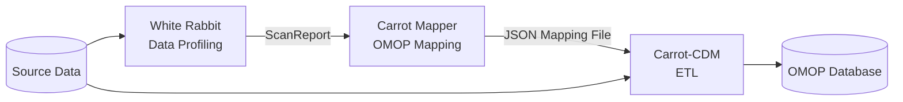

# OMOP Mapping Tools

Mapping source data to OMOP can be challenging and requires specialist skills and tools. This page describes the tools available and the support HDR UK can offer.

!!! tip "Separate mapping from ETL"
    It is easier to separate the **mapping logic** from the **ETL step**. This allows non-technical subject matter experts to create mapping rules (using Carrot Mapper) that are then applied by an automated ETL tool (Carrot-CDM).

---

## Supported tools

=== "White Rabbit — Data Profiling"

    **Developed by:** [OHDSI](https://www.ohdsi.org/software-tools/)

    White Rabbit is typically the **first tool** used in the ETL process. It scans your source data and produces a detailed report on tables, fields, and values.

    **What it does:**

    - Scans source databases (MS Access, CSV, SQL databases, etc.)
    - Produces a **Scan Report** describing table names, field names, data types, and value frequencies
    - Outputs a structured file used as input to Carrot Mapper

    **Output:** A ScanReport file (Excel format)

    ```bash title="Running White Rabbit"
    # White Rabbit is a Java application — download from OHDSI GitHub
    java -jar WhiteRabbit.jar
    ```

    [:octicons-arrow-right-24: White Rabbit on OHDSI](https://www.ohdsi.org/software-tools/)

=== "Carrot Mapper — OMOP Mapping"

    **Developed by:** HDR UK / CO-CONNECT project

    Carrot Mapper is a web-tool that maps the White Rabbit output to generate a **JSON mapping file** that defines the ETL guidelines for your dataset.

    **What it does:**

    - Accepts the White Rabbit ScanReport as input
    - Provides a web interface for mapping source fields to OMOP CDM fields
    - Generates a JSON Mapping File used by Carrot-CDM

    **Output:** A JSON mapping file

    [:octicons-arrow-right-24: Carrot Mapper documentation](https://carrot4omop.ac.uk/Carrot-Mapper/)

=== "Carrot-CDM — ETL to OMOP"

    **Developed by:** HDR UK / CO-CONNECT project

    Carrot-CDM automates the extraction of pseudonymised data, transformation to OMOP CDM, and loading into the query tool database.

    **What it does:**

    - Takes your source data and the Carrot Mapper JSON mapping file as inputs
    - Automates the full ETL process to produce an OMOP-formatted database
    - Loads data into a format ready for Bunny or similar query tools

    ```bash title="Running Carrot-CDM"
    pip install carrot-cdm
    carrot run --rules mapping_rules.json --input source_data/
    ```

    [:octicons-arrow-right-24: Carrot-CDM documentation](https://carrot4omop.ac.uk/CaRROT-CDM/)

---

## Process overview



---

## Alternative tools

!!! note "CaRROT tools are not mandatory"
    HDR UK has worked with and can support the CaRROT toolchain. Other tools are available:

    | Alternative | Purpose | Notes |
    |-------------|---------|-------|
    | [Usagi](https://www.ohdsi.org/analytic-tools/usagi/) | Manual OMOP code mapping | Developed by OHDSI; useful for term-level mapping |
    | Commercial ETL vendors | End-to-end OMOP ETL | Various vendors available |

---

## HDR UK mapping support

HDR UK and partners at the **Health Informatics Centre (HIC), University of Dundee** offer OMOP mapping services using CaRROT tools.

!!! hdruk "Need mapping support?"
    Contact your HDR UK contact or email [gateway@hdruk.ac.uk](mailto:gateway@hdruk.ac.uk) to discuss OMOP mapping support options.
