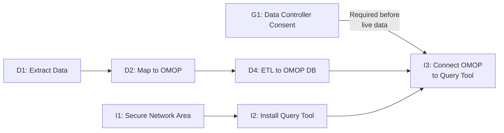

# Workstreams

Onboarding to the Cohort Discovery Service requires completing three core workstreams. These can be run in parallel, though some interdependencies exist.

- :material-shield-check: **Governance**

    ---
    Obtain consent, complete local approvals, and conduct risk assessments.

    [:octicons-arrow-right-24: Governance](governance.md)

- :material-database-arrow-right: **Data**

    ---
    Extract, map to OMOP, and ETL your data to the secure environment.

    [:octicons-arrow-right-24: Data](data.md)

- :material-server: **Infrastructure**

    ---
    Set up your secure network area and install query retrieval software.

    [:octicons-arrow-right-24: Infrastructure](infrastructure.md)

---

## Interdependencies

*Figure 4 — Interdependencies between tasks for onboarding to Cohort Discovery*

!!! warning "Key rule"
    **G1 (Data Controller Consent)** must be complete before live (non-synthetic) data is connected to Cohort Discovery. D1, D2, and D3 can proceed before G1.
